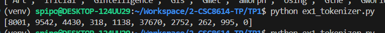

- Nom : Bilal OUEDERNI

#### Commandes d'installation/activation d'environnement :
```bash
python -m venv venv
source venv/bin/activate
pip install -r requirements.txt
```

#### Versions (présentes dans requirements.txt)
```bash
torch==2.9.0
transformers==4.57.5
scikit-learn==1.8.0
plotly==6.5.2
numpy==2.4.1
pandas==2.3.3
```

# Exercice 1 : Rendu (GitHub) et rapport Markdown
## Question 1.a.
- Mon seed est fixé à 3333.
- La version de Python installée est 3.12.3.
- Les versions des principales bibliothèques sont présentes en en-tête de ce rapport ainsi que dans le fichier `requirements.txt`.
- Je réalise et fais tourner ce TP sur un WSL (basé sur Ubuntu 24.04.3).

# Exercice 2 : Découverte du tokenizer GPT-2
## Question 2.a.
**Sortie du programme** : 
```
(venv) spipo@DESKTOP-124UU29:~/Workspace/2-CSC8614-TP/TP1$ python ex1_tokenizer.py 
['Art', 'ificial', 'Ġintelligence', 'Ġis', 'Ġmet', 'amorph', 'osing', 'Ġthe', 'Ġworld', '!']
```

**Explication** : 
Le préfixe Ġ (ou symbole d’espace explicite) marque qu’un token commence par un espace réel dans le texte d’origine. Cela permet au tokenizer byte‑level BPE de distinguer "word" (continuation) de " Ġword" (début de mot), préservant les frontières entre mots sans devoir ajouter explicitement des tokens séparateurs. Conserver cette information aide le décodage exact du texte et améliore la cohérence des prédictions du modèle (par ex. il préfère compléter un mot au début plutôt qu’en milieu de mot). En pratique, cela facilite aussi la tokenisation de langues avec espaces et réduit les ambiguïtés sur la segmentation en sous‑mots.

**Capture d'écran** : 


## Question 2.b.
| Token               | ID     | Remarque            |
|---------------------|--------|---------------------|
| Art                 | 8001   | début de mot, sous‑mot |
| ificial             | 9542   | sous-mot |
| Ġintelligence       | 4430   | espace initial + mot complet |
| Ġis                 | 318    | espace initial + mot complet |
| Ġmet                | 1138   | espace initial + début de mot, sous-mot |
| amorph              | 37670  | sous‑mot |
| osing               | 2752   | sous‑mot |
| Ġthe                | 262    | espace initial + mot complet |
| Ġworld              | 995    | espace initial + mot complet |
| !                   | 0      | ponctuation |

- Les tokens sont les unités textuelles lisibles produites par le tokenizer (mots entiers, sous‑mots, ponctuation ou marqueurs comme "Ġ" indiquant un espace). Ce sont des chaînes de caractères.

- Les token IDs sont les entiers correspondants dans le vocabulaire du modèle. Chaque token a un index unique que le modèle utilise comme entrée numérique. 

On utilise le tokenizer pour réaliser la conversion entre les 2.

## Question 2.c.

- **Découpage de mots**
    - "Art" + "ificial" reconstituent “Artificial”. GPT-2 segmente les mots en fragments utilisables plusieurs fois plutôt qu’en mots entiers systématiques. 
    - On remarque le concept de recherche de fragments fréquents réutilisables (sous‑mots) pour représenter de nombreux mots différents avec un vocabulaire limité.
- **Découpage de mots rares/longs**
    - Exemple : "met" + "amorph" + "osing" pour “metamorphosing”. Les mots longs ou rares sont découpés en plusieurs tokens de taille variable.
    - BPE décompose les mots rares en unités plus petites déjà présentes dans le vocabulaire (réduction du coût de représenter des mots peu fréquents).
- **Gestion de la ponctuation**
    - Exemple : "!" est un token propre (ID 0 dans l’exemple). La ponctuation est typiquement séparée plutôt qu’attachée au mot précédent. 
    La ponctuation fréquente est gardée comme unité distincte afin d’encoder efficacement sa fonction syntaxique/orthographique sans mêler ses occurrences à celles des mots.
- **Gestion des espaces**
    - Les tokens commençant par "Ġ" (Ġintelligence, Ġis, Ġthe, Ġworld) indiquent un espace initial. Le tokenizer distingue "intelligence" précédé d’un espace de "intelligence" collé au début d’un texte. 
    - Conserver l’information d’espace permet de réutiliser les mêmes sous‑mots pour des positions différentes (début de mot vs continuation) sans multiplier inutilement les entrées du vocabulaire.

## Question 2.d.
- **Liste des tokens** : ['G', 'PT', 'Ġmodels', 'Ġuse', 'ĠB', 'PE', 'Ġtoken', 'ization', 'Ġto', 'Ġprocess', 'Ġunusual', 'Ġwords', 'Ġlike', 'Ġant', 'idis', 'establishment', 'arian', 'ism', '.'] (19 sous-tokens au total)
- **Liste des tokens du mot le plus long** : ['ant', 'idis', 'establishment', 'arian', 'ism', '.'] (6 sous-tokens au total)

Ce mot est découpé comme tel car ces unités plus petites se rapprochent de mots existants, ce qui réduit le coût de représenter des mots peu fréquents, comme indiqué dans la dernière question.

Par exemple, on a des termes comme "ant" et "establishment" qui se rapportent à des mots existants en anglais, ainsi que "ism" qui est une terminaison courante de mots en anglais. Pour les tokens restants, GPT-2 les garde tels quels, car sur-fragmenter ces mots reviendrait à multiplier les entrées du vocabulaire et à réduire l'efficacité du modèle à grande échelle.

# Exercice 3 : Analyse des encodages positionnels dans GPT-2

