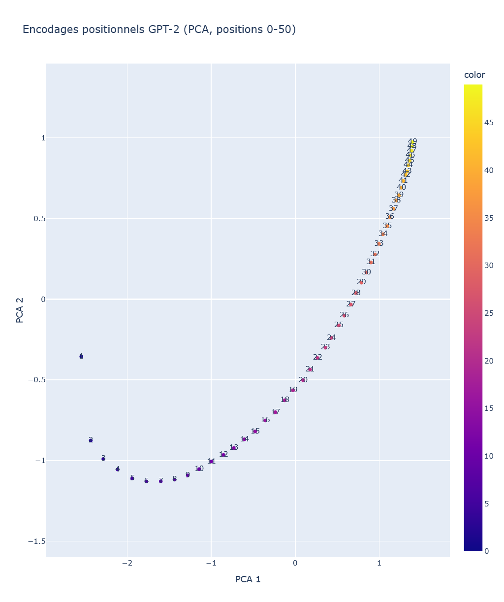
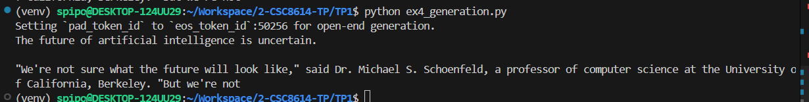

- Nom : Bilal OUEDERNI

#### Commandes d'installation/activation d'environnement :
```bash
python -m venv venv
source venv/bin/activate
pip install -r TP1/requirements.txt
```

#### Versions (présentes dans requirements.txt)
```bash
torch==2.9.0
transformers==4.57.5
scikit-learn==1.8.0
plotly==6.5.2
numpy==2.4.1
pandas==2.3.3
```

# Exercice 1 : Rendu (GitHub) et rapport Markdown
## Question 1.a.
- Mon seed est fixé à 3333.
- La version de Python installée est 3.12.3.
- Les versions des principales bibliothèques sont présentes en en-tête de ce rapport ainsi que dans le fichier `requirements.txt`.
- Je réalise et fais tourner ce TP sur un WSL (basé sur Ubuntu 24.04.3).

# Exercice 2 : Découverte du tokenizer GPT-2
## Question 2.a.
**Sortie du programme** : 
```
(venv) spipo@DESKTOP-124UU29:~/Workspace/2-CSC8614-TP/TP1$ python ex1_tokenizer.py 
['Art', 'ificial', 'Ġintelligence', 'Ġis', 'Ġmet', 'amorph', 'osing', 'Ġthe', 'Ġworld', '!']
```

**Explication** : 
Le préfixe Ġ (ou symbole d’espace explicite) marque qu’un token commence par un espace réel dans le texte d’origine. Cela permet au tokenizer byte‑level BPE de distinguer "word" (continuation) de " Ġword" (début de mot), préservant les frontières entre mots sans devoir ajouter explicitement des tokens séparateurs. Conserver cette information aide le décodage exact du texte et améliore la cohérence des prédictions du modèle (par ex. il préfère compléter un mot au début plutôt qu’en milieu de mot). En pratique, cela facilite aussi la tokenisation de langues avec espaces et réduit les ambiguïtés sur la segmentation en sous‑mots.

**Capture d'écran** : 


## Question 2.b.
| Token               | ID     | Remarque            |
|---------------------|--------|---------------------|
| Art                 | 8001   | début de mot, sous‑mot |
| ificial             | 9542   | sous-mot |
| Ġintelligence       | 4430   | espace initial + mot complet |
| Ġis                 | 318    | espace initial + mot complet |
| Ġmet                | 1138   | espace initial + début de mot, sous-mot |
| amorph              | 37670  | sous‑mot |
| osing               | 2752   | sous‑mot |
| Ġthe                | 262    | espace initial + mot complet |
| Ġworld              | 995    | espace initial + mot complet |
| !                   | 0      | ponctuation |

- Les tokens sont les unités textuelles lisibles produites par le tokenizer (mots entiers, sous‑mots, ponctuation ou marqueurs comme "Ġ" indiquant un espace). Ce sont des chaînes de caractères.

- Les token IDs sont les entiers correspondants dans le vocabulaire du modèle. Chaque token a un index unique que le modèle utilise comme entrée numérique. 

On utilise le tokenizer pour réaliser la conversion entre les 2.

## Question 2.c.

- **Découpage de mots**
    - "Art" + "ificial" reconstituent “Artificial”. GPT-2 segmente les mots en fragments utilisables plusieurs fois plutôt qu’en mots entiers systématiques. 
    - On remarque le concept de recherche de fragments fréquents réutilisables (sous‑mots) pour représenter de nombreux mots différents avec un vocabulaire limité.
- **Découpage de mots rares/longs**
    - Exemple : "met" + "amorph" + "osing" pour “metamorphosing”. Les mots longs ou rares sont découpés en plusieurs tokens de taille variable.
    - BPE décompose les mots rares en unités plus petites déjà présentes dans le vocabulaire (réduction du coût de représenter des mots peu fréquents).
- **Gestion de la ponctuation**
    - Exemple : "!" est un token propre (ID 0 dans l’exemple). La ponctuation est typiquement séparée plutôt qu’attachée au mot précédent. 
    La ponctuation fréquente est gardée comme unité distincte afin d’encoder efficacement sa fonction syntaxique/orthographique sans mêler ses occurrences à celles des mots.
- **Gestion des espaces**
    - Les tokens commençant par "Ġ" (Ġintelligence, Ġis, Ġthe, Ġworld) indiquent un espace initial. Le tokenizer distingue "intelligence" précédé d’un espace de "intelligence" collé au début d’un texte. 
    - Conserver l’information d’espace permet de réutiliser les mêmes sous‑mots pour des positions différentes (début de mot vs continuation) sans multiplier inutilement les entrées du vocabulaire.

## Question 2.d.
- **Liste des tokens** : ['G', 'PT', 'Ġmodels', 'Ġuse', 'ĠB', 'PE', 'Ġtoken', 'ization', 'Ġto', 'Ġprocess', 'Ġunusual', 'Ġwords', 'Ġlike', 'Ġant', 'idis', 'establishment', 'arian', 'ism', '.'] (19 sous-tokens au total)
- **Liste des tokens du mot le plus long** : ['ant', 'idis', 'establishment', 'arian', 'ism', '.'] (6 sous-tokens au total)

Ce mot est découpé comme tel car ces unités plus petites se rapprochent de mots existants, ce qui réduit le coût de représenter des mots peu fréquents, comme indiqué dans la dernière question.

Par exemple, on a des termes comme "ant" et "establishment" qui se rapportent à des mots existants en anglais, ainsi que "ism" qui est une terminaison courante de mots en anglais. Pour les tokens restants, GPT-2 les garde tels quels, car sur-fragmenter ces mots reviendrait à multiplier les entrées du vocabulaire et à réduire l'efficacité du modèle à grande échelle.

# Exercice 3 : Analyse des encodages positionnels dans GPT-2
## Question 3.a.

- Shape : [1024, 768]
    - Première dimension (n_positions) : Nombre de positions différentes codées. Longueur maximale de contexte
    - Deuxième dimension (n_embd) : Dimension du vecteur d'embedding pour chaque position

n_positions = 1024 veut dire que le modèle peut représenter et traiter au maximum 1024 tokens de contexte simultanément. 

## Question 3.b.

On observe une trajectoire lisse et continue des encodages positionnels (positions 0 -> 50) : les points forment une courbe progressive. Les premières positions sont décroissantes jusqu'environ la position 6/7, puis elles commencent à croître et semblent converger vers une valeur (l'évolution ralentit, on observe ça surtout au niveau des positions les plus élevées). Il n’y a pas de cassures nettes ni de clusters disjoints, juste une évolution structurée des représentations positionnelles.

Ici, la PCA (Principal Component Analysis) sert à rendre observable ce qui vit dans un espace de très haute dimension (ici 768) en le projetant sur 2 dimensions interprétables.

## Question 3.c.


La structure est moins facilement interprétable, car il s'agit d'une sorte de spirale avec de gros changements entre les positions 0 et 1, ainsi que 1 et 2. On constate malgré cela des structures à plus grande échelle.

Les embeddings positionnels combinent deux "types" de composantes : basses fréquences (tendance lisse) et hautes fréquences (motifs périodiques, tendances locales). Sur 0-50, la basse fréquence suffit à expliquer la dynamique observée. Sur 0–200, les composantes supplémentaires produisent des motifs plus complexes dans la projection, ce qui indique soit une périodicité apprise, soit une saturation lié à la capacité finie de l'espace d'embedding. 

# Exercice 4 : Probabilités et génération de texte avec GPT-2
## Question 4.a.
```bash
(venv) spipo@DESKTOP-124UU29:~/Workspace/2-CSC8614-TP/TP1$ python ex3_probs.py 124/124 [00:00<00:00, 828kB/s]
1 'ificial' 1.920e-05
2 ' intelligence' 1.505e-01
3 ' is' 1.955e-01
4 ' fascinating' 6.504e-04
5 '.' 1.773e-01
```
Les logits calculés à la position "t-1" sont ceux qui prédisent le token en position t. 

Un modèle autoregressif causal (GPT-2) lit une séquence de tokens $x_0, x_1, …, x_T$ et, à chaque pas t, produit un vecteur de logits basé sur l’état caché obtenu après avoir vu les tokens jusqu’à t. Ces logits servent à estimer la distribution du token suivant. 

## Question 4.b.
total_logp: -23.454935550689697
perplexity: 108.96068293473512

La perplexité mesure l’incertitude moyenne d’un modèle probabiliste sur une séquence. Il s'agit de l’exponentielle de la perte de cross‑entropie (exp de la moyenne des log‑pertes).

Intuitivement, elle correspond au “nombre moyen de choix équiprobables” que le modèle doit faire à chaque pas. Plus la perplexité est faible, mieux le modèle prédit. Une perplexité de k signifie qu’à chaque token le modèle se comporte comme s’il choisissait entre k options également probables.

## Question 4.c.
Pour "Artificial intelligence is fascinating." : perplexity: 108.96068293473512
Pour "Artificial fascinating intelligence is." : perplexity: 4595.889933131633

Une perplexité si élevée signifie que le modèle trouve la phrase très improbable (probabilité moyenne par token ≈ e^(−8.43) ≈ 2.2·10^−4). 

Chaque token surprend le modèle comme s’il devait choisir entre ~4 600 options équiprobables. Cela contraste fortement avec une phrase bien formée et fréquente (comme « Artificial intelligence is fascinating. »), qui a une perplexité beaucoup plus basse à 108.

## Question 4.d.
Pour "L'intelligence artificielle est fascinante." : perplexity: 383.04208933082975

On constate ici une perplexité plus élevée que la phrase normale anglaise mais beaucoup plus faible que la phrase erronée.

C'est dû à plusieurs raisons : 
- Au fait que le modèle a été entraîné sur des données textuelles en majorité anglaises, et les mod-les principalement anglophones traiteront forcément moins bien les phrases d'autres langues en comparaison avec les phrases anglaises 
- Au fait que les mots français peuvent se découper en sous-mots rares, ce qui augmente la surprise token par token
- Au fait que sur une phrase courte, chaque token pèse beaucoup sur la perplexité moyenne ; un ou deux tokens rares font fortement monter la valeur.

## Question 4.e.
Propositions : 
```
' a' 1.205e-01
' the' 5.254e-02
' not' 4.324e-02
' an' 3.092e-02
' now' 2.062e-02
' one' 1.890e-02
' also' 1.880e-02
' already' 1.716e-02
' becoming' 1.606e-02
' just' 1.422e-02
```

Ces propositions me semblent probables. Elles sont toutes correctes grammaticalement et des suites logiques au préfixe. On constate un espace avant chaque mot dans les propositions.

# Exercice 5 : Exploration des méthodes de génération avec GPT-2

## Question 5.a.
J'ai mis mon seed à 3333.

Le seed sert à générer des nombres aléatoires de manière reproductible, et ça permet de garantir une reproductibilité en "figeant" les parties aléatoires du programme.

## Question 5.b.
Texte généré : 

```
The future of artificial intelligence is uncertain.

"We're not sure what the future will look like," said Dr. Michael S. Schoenfeld, a professor of computer science at the University of California, Berkeley. "But we're not
```

Le texte est identique après relancement, car le seed est fixé et les probabilités sont donc figées au niveau de la génération de texte, donc le modèle sélectionnera toujours les mêmes suites de mots.



## Question 5.c.
Voici 2 sorties différentes générées : 
```
SEED 3
Setting `pad_token_id` to `eos_token_id`:50256 for open-end generation.
The future of artificial intelligence is bright and bright. The future of the Internet of Things, and the future of the future of the Internet of Things industry.

The future of the Internet of Things, and the future of the Internet of Things industry

SEED 4
Setting `pad_token_id` to `eos_token_id`:50256 for open-end generation.
The future of artificial intelligence is very, very bright. The future of artificial intelligence is very, very bright.


So, you know, I have a question for you.


MR. JOHNSON: And what about human-
```

Les sorties semblent diverses, mais il se produit beaucoup de répétitions, et les phrases semblent incohérentes entre elles. 

- La température ajuste l'échelle des logits avant softmax. Plus elle est proche de 0, plus la distribution sera pointue (ce qui donne des sorties déterministes, avec globalement moins d'erreurs mais des répétitions possibles). Plus elle est proche de 1, plus elle conservera la distribution d'origine, et donc plus il y aura de possibilités, mais globalement moins de cohérence.
- Le top-k restreint la distribution aux K tokens les plus probables. En ajustant ce paramètre, on peut contrôler à quel point le modèle sera créatif/aléatoire dans ses réponses (plus la valeur est haute, plus le modèle sera créatif).
- Le top-p définit un seuil de probabilité pour la sélection des tokens. Il permet au modèle de choisir parmi le plus petit groupe de mots dont les probabilités combinées dépassent une valeur spécifiée, ce qui permet d'équilibrer le caractère aléatoire et la cohérence du texte généré.

## Question 5.d. 
Sortie sans pénalité : 
```
SEED 1
Setting `pad_token_id` to `eos_token_id`:50256 for open-end generation.
The future of artificial intelligence is up in the air, and the future of artificial intelligence is now about to change. For now, we're just waiting for the technology to be perfected so that we can take it to the next level.

The
```
Sortie avec pénalité : 
```
SEED 1
Setting `pad_token_id` to `eos_token_id`:50256 for open-end generation.
The future of artificial intelligence is up in the air, and it may not be as interesting or useful to us humans. But we're going down a path where our ability for thinking about things could become less important than ever before."
 (Photo:
```

Le compromis « cohérence vs diversité » décrit le choix entre réponses sûres et répétitives ou réponses variées et créatives. 

- En privilégiant la cohérence (température basse, top‑k et top-p stricts), le modèle produit des phrases très probables, grammaticales et prévisibles — utile pour la fiabilité. 
- En favorisant la diversité (température élevée, top‑p large), on obtient des tournures inattendues, originales, parfois plus riches mais aussi plus risquées et incohérentes. 

Pour une tâche factuelle, on cherche de la cohérence, et pour de la génération créative, on accepte des erreurs pour gagner en "surprise". Ajuster ces paramètres revient à régler le degré de liberté de génération du modèle.

## Question 5.f.

Sortie beam search : 

```
(venv) spipo@DESKTOP-124UU29:~/Workspace/2-CSC8614-TP/TP1$ python ex4_generation.py 
Setting `pad_token_id` to `eos_token_id`:50256 for open-end generation.
The future of artificial intelligence is in the hands of the next generation of scientists and engineers.

The future of artificial intelligence is in the hands of the next generation of scientists and engineers.

The future of artificial intelligence is in the hands of
```

On a très clairement un problème de répétition. La phrase en elle-même semble cohérente, mais le modèle la répète, ce qui donne un rendu aussi cohérent que du recopiage bête et simple de phrases (comme Bart Simpson dans l'intro de la série "Les Simpsons").

## Question 5.g.

Globalement, les temps semblent plus longs, mais la sortie est restée la même. 

num_beams = 10 : ~10s
num_beams = 20 : ~15s

Concrètement, le beam search maintient B meilleures séquences partielles à chaque pas. À chaque étape de génération (longueur L), le modèle doit évaluer logits pour ces B préfixes puis sélectionner les meilleurs B parmi (B × V) candidats (V = taille du vocabulaire ou après tronquage). 