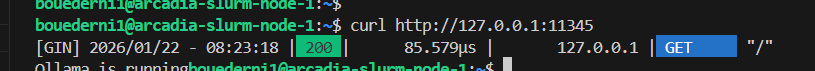
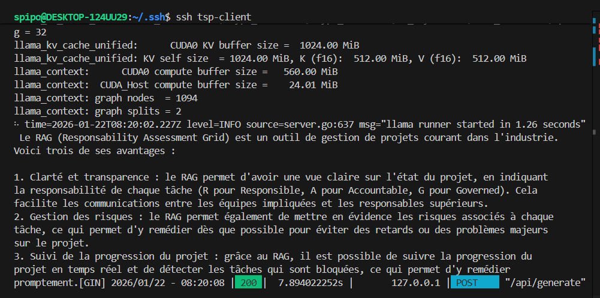
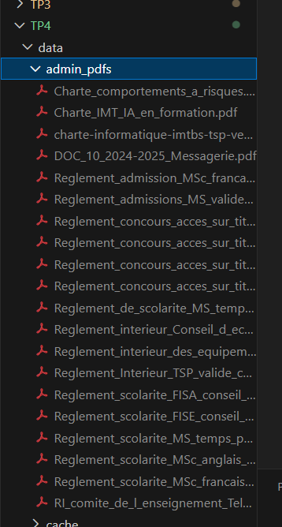
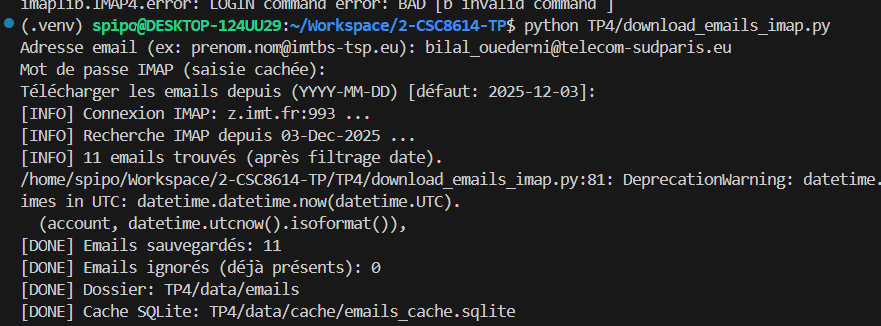
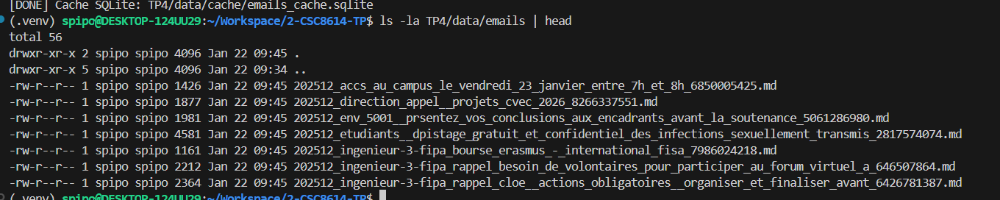
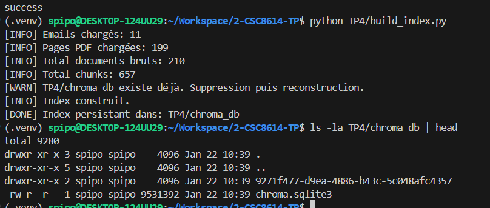
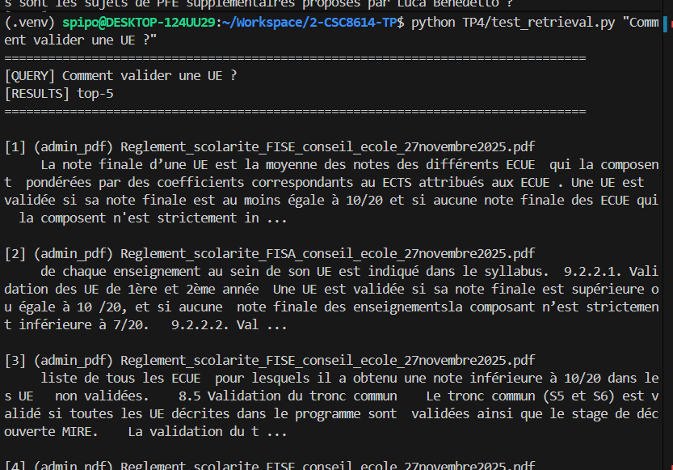
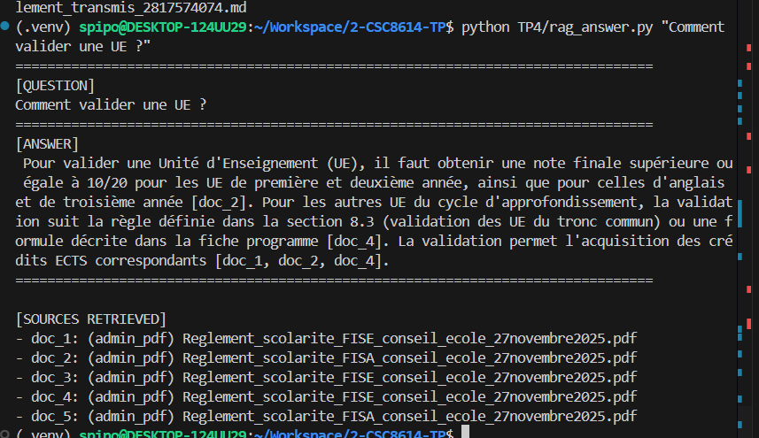
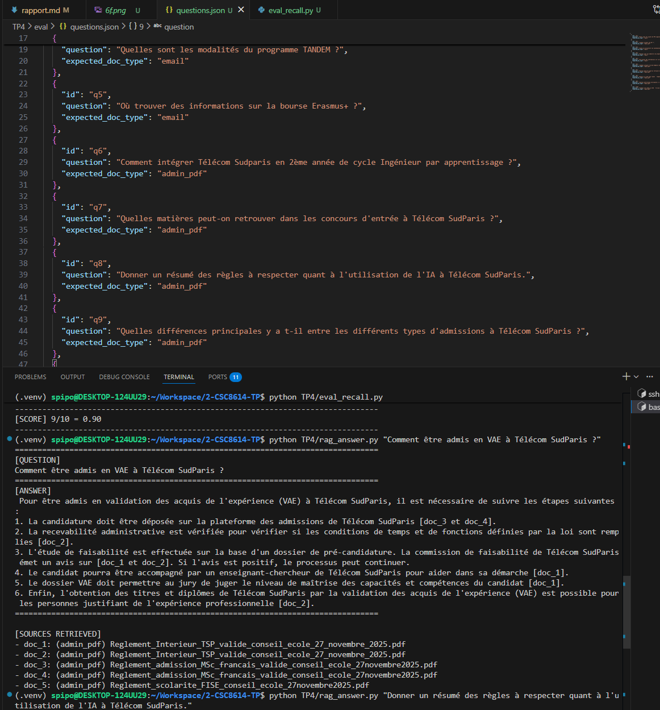

# Exercice 1 : Démarrage d'Ollama (local ou cluster)

## Question 1.h.

### 1. Résultat de `curl http://127.0.0.1:PORT`



### 2. Résultat (réduit) du `ollama run`: 
*


### 3. Port choisi

- J'ai utilisé le port 11345 comme demandé.

# Exercice 2 : Constituer le dataset (PDF administratifs + emails IMAP) et installer les dépendances

## Question 2.b.



J'ai inclus les contenus du dossier `TP4/admin_pdfs` dans mon `.gitignore`.

## Question 2.f.

## 1. Commande d'exécution du script



## Nombre de fichiers créés dans `TP4/data/emails/`

Dans la capture d'écran ci-présente, le nombre d'emails sauvegardés est à 11. J'ai bien 11 fichiers dans mon dossier `TP4/data/emails`.

## 3. Résultat de la commande `head`



# Exercice 3 : Indexation : charger PDFs + emails, chunker, créer l’index Chroma (persistant)

## Question 3.e.



# Exercice 4 : Retrieval : tester la recherche top-k (sans LLM) et diagnostiquer la qualité

## Question 4.e.



Ma valeur de top-k est à 5.

# Exercice 5 : RAG complet : génération avec Ollama + citations obligatoires

## Question 5.d.

Résultat : 
```
(.venv) spipo@DESKTOP-124UU29:~/Workspace/2-CSC8614-TP$ python TP4/rag_answer.py "Quelle est la météo à Paris demain ?"
================================================================================
[QUESTION]
Quelle est la météo à Paris demain ?
================================================================================
[ANSWER]
 L'information demandée (la météo à Paris demain) n'est pas présente dans le contexte. Il manque donc deux informations : la date prévue pour demain et une source de prévisions météorologiques. Je ne peux donc pas vous donner la réponse demandée.
================================================================================
```

On remarque que le modèle s'abstient bien de fournir une réponse, nous indiquant que les documents ne contiennent pas les informations demandées.

## Question 5.e.



# Exercice 6 : Évaluation : créer un mini dataset de questions + mesurer Recall@k + analyse d’erreurs

## Question 6.e.

J'ai eu un score de 9/10 (échoué sur le mail de Luca Benedetto).

## Question 6.f.

### 1. [QUESTION] Quelles matières peut-on retrouver dans les concours d'entrée à Télécom SudParis ?

[ANSWER]
 Dans les concours d'entrée à Télécom SudParis, vous pouvez retrouver des matières telles que :

1. Étude de dossier [doc_1][doc_2]
2. Épreuve d'entretien [doc_1][doc_2]
3. Éventuellement une ou plusieurs épreuves probatoires dans certaines disciplines (pas spécifié pour chaque concours) [doc_1][doc_2]
4. Communication écrite et orale, communication en langues étrangères, ouverture culturelle, expérience internationale [doc_5]
5. Activités de l'ingénieur et leurs contextes : contexte externe, sociétal et environnemental, contexte et environnement de l'entreprise, ingénierie (conception, réalisation, exploitation de produits, services, systèmes, contenus...), gestion de projets, innovation, entrepreneuriat, expériences en entreprise [doc_5]

Ces matières sont des composantes du processus de sélection pour les concours d'entrée à Télécom SudParis.

Score : 1

### 2. [QUESTION] Comment être admis en VAE à Télécom SudParis ?

[ANSWER]
 Pour être admis en validation des acquis de l'expérience (VAE) à Télécom SudParis, il est nécessaire de suivre les étapes suivantes :
1. La candidature doit être déposée sur la plateforme des admissions de Télécom SudParis [doc_3 et doc_4].
2. La recevabilité administrative est vérifiée pour vérifier si les conditions de temps et de fonctions définies par la loi sont remplies [doc_2].
3. L'étude de faisabilité est effectuée sur la base d'un dossier de pré-candidature. La commission de faisabilité de Télécom SudParis émet un avis sur [doc_1 et doc_2]. Si l'avis est positif, le processus peut continuer.
4. Le candidat pourra être accompagné par un enseignant-chercheur de Télécom SudParis pour aider dans sa démarche [doc_1].
5. Le dossier VAE doit permettre au jury de juger le niveau de maîtrise des capacités et compétences du candidat [doc_1].
6. Enfin, l'obtention des titres et diplômes de Télécom SudParis par la validation des acquis de l'expérience (VAE) est possible pour les personnes justifiant de l'expérience professionnelle [doc_2].

Score : 2

### 3. [QUESTION] Donner un résumé des règles à respecter quant à l'utilisation de l'IA à Télécom SudParis.

[ANSWER]
 Les étudiants de Télécom SudParis doivent respecter certaines règles pour l'utilisation de l'IA :
1. L'usage des systèmes d'intelligence artificielle générative est autorisé sous certaines conditions et doit être mentionné explicitement [doc_2].
2. L'IA ne peut jamais se substituer à la réflexion personnelle ou à la maîtrise attendue des connaissances [doc_1].
3. Les étudiants sont responsables des contenus produits et doivent vérifier l'exactitude des informations générées [doc_1].
4. L'utilisation d'IA doit respecter les lois en vigueur (protection des données, propriété intellectuelle) et les consignes pédagogiques [doc_2].
5. Les travaux doivent être réalisés personnellement, sauf indication contraire [doc_2].
6. Toute utilisation d'IA doit être conforme à la Charte de bonne utilisation des systèmes d'intelligences artificiel les génératives en formation [annexe 10 du présent règlement] [doc_2].
7. L'engagement à se former sur les enjeux techniques, environnementaux et sociétaux liés à l'IA est attendu [doc_1].
8. Le partage d’expériences entre pairs est encouragé pour favoriser une meilleure appropriation collective de ces technologies [doc_1].

Score : 2

## Question 6.g.

Je n'ai pas eu d'échecs à résoudre de cette manière. 

Concrètement, j'ai eu 2 échecs : 
- Un sur la question par rapport au mail de Luca Benedetto. Je n'avais pas conservé le mail de Luca Benedetto par rapport aux sujets PFE, car mon sujet était déjà sélectionné et j'ai tendance à supprimer les mails dont je n'ai plus besoin.
- Un autre léger sur la première query dans la question précédente : "[QUESTION] Quelles matières peut-on retrouver dans les concours d'entrée à Télécom SudParis ?". Le modèle n'a pas compris ce que je voulais dire par "matière" (je pensais + aux mathématiques, réseaux, ...) mais je pense que j'aurais pu améliorer mon prompt pour qu'il me donne ce que je souhaitais comme réponse.

## Question 6.h.



La capture d'écran contient tous les éléments demandés.

## Question 6.i.

J'ai trouvé que le modèle que j'ai utilisé a fait un assez bon travail pour retrouver des informations dans les documents et les résumer pour répondre à mes prompts. Principalement, mon souci résidait dans la clarté de mon prompt par rapport aux "matières". Je n'ai pas repéré de points d'amélioration à appliquer jusqu'à maintenant. 